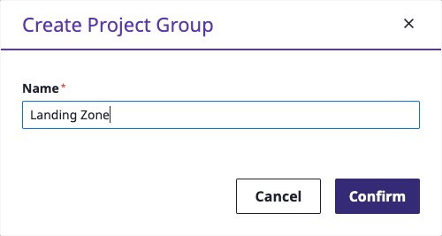
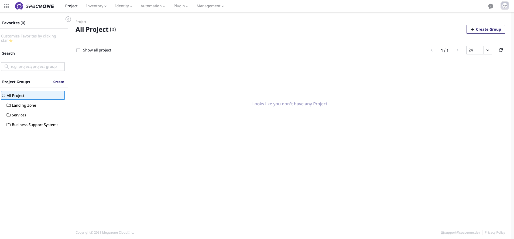
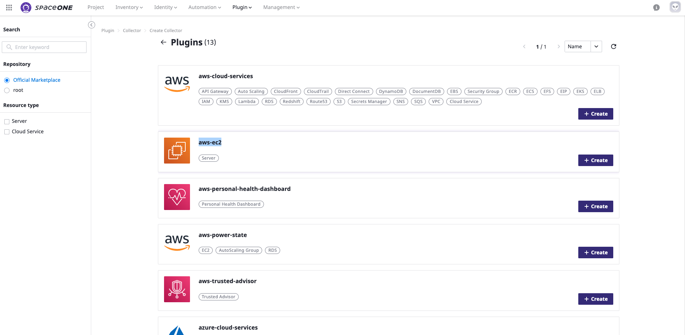
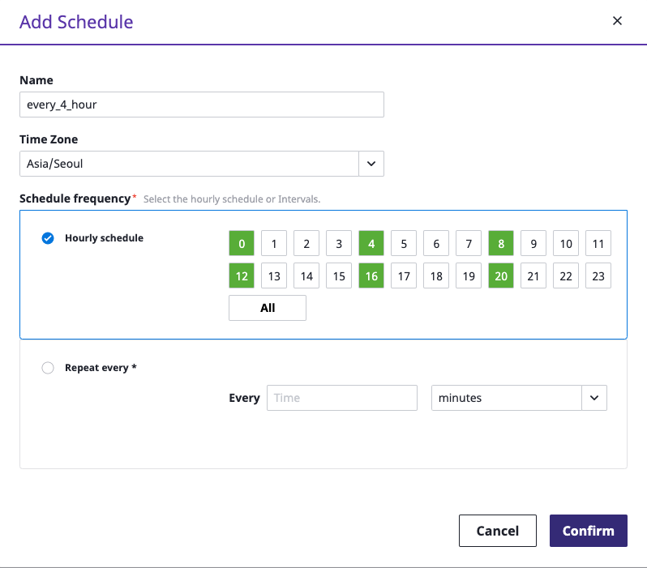

# Domain Admin

## Sign-in

**`Domain Admin`** 은 일반 Log-in 페이지를 통해 Log-in 합니다. **`Root Account`**에게서 받은 이메일에 ID/Password 또는 Google Oauth2와 같은 Single-Sign-On 방식의 접속정보가 명시되어 있습니다.

**`Domain Admin`** 은 최상위 프로젝트 그룹을 만들고, 사용자를 생성하며, 주요 **`Collector`**를 설정합니다.

**STEP 1: `Domain Admin`Role 이 부여된 User로 Log-in 합니다.** 

## 프로젝트 그룹 생성

SpaceONE의 모든 자원은 특정 **`Project`**에 소속되어 있습니다. 또한,  **`Project Group`**은 **`Project`**를 그룹화합니다. 

Domain Admin은 회사의 관리 정책에 따라서 최상위 **`Project Group`**을 생성합니다. 


**`Project`** 생성 권한은 **`Project Admin`**으로 지정된 **`General User`** 에게 있습니다. 


**STEP 1: 상단 Navigation에서 Project 선택 후, `Landing Zone`라는 이름으로 `Project Group`을 생성합니다.** 

**STEP 2: `Services` 라는 이름으로 `Project Group`을 생성합니다.**

**STEP 3: `Business Support System` 이라는 `Project Group`을 생성합니다.** 

**STEP 4: SpaceONE console의 좌측 navigation 에서 생성된 `Project Group`을 확인할 수 있습니다.**

**STEP 5:** Check all 3 project groups have created a tree on the left menu.

## Create User

Create general users and assign the project groups to the created user. General users can access only the project group to which they are belonged to.

**STEP 1:** Drive to menu **`Identity > User`** at the top bar. 

  
**STEP 2:** Click **`+ Add`** button to add a domain Admin user.

**STEP 3:** Fill out all required fields ****and click **`Confirm`** button once finish.

**STEP 4:** Drive to Project ****and click **MEMBER** icons at right next to **`+ Create Project`** button.

**STEP 5:** Click **`+ Add`** button and select members to add to the project group on the list at the pop-up window.

**STEP 6:** Click **`Confirm`** button when you finish to all members and set their role as project admin.

\*\*\*\*

**STEP 7:** Check all selected members have registered as project members.

## Cloud Resource Collectors

**Cloud Resource Collector** \(a.k.a **CRC**\) is a plugin that collects cloud resources across platforms such as AWS, Google Cloud, Azure, CRC is set by Domain Admin only.

**STEP 1:** Drive to Menu **`Plugin > Collector`**and Click **`+ Create`**button.

### **Create AWS EC2 Collector**

**STEP 1:** Select **AWS-ec2** plugin and Click **`+ Create`** Button. ****

\*\*\*\*

**STEP 2:** Please, fill out all required fields and select drop downs for each steps \(**add tags** is optional\) and Click **`Confirm`** button to create **AWS EC2 collector**.

### **Create AWS Cloud Services Collector** 

**STEP 1:** Select AWS**-cloud-services** plugin and Click **`+ Create`** Button. ****

  
**STEP 2:** Please, fill out all required fields and select drop downs for each steps \(**Add Tags** is Optional\) and Click **`Confirm`** button to create **AWS Cloud Service Collecto**r.

\*\*\*\*

### **Create AWS  Trusted Advisor Collector** 

**STEP 1:** Select **AWS-trusted-advisor** plugin and Click **`+ Create`** Button. ****

**STEP 2:** Please, fill out all required fields and select drop downs for each steps \(**add Tags** is optional\) and Click **`Confirm`** button to create **AWS Trusted Advisor collecto**r.

\*\*\*\*

### **Create AWS Health Dashboard Collector** 

**STEP 1:** Select **AWS-personal-health-dashboard** plugin and Click **`+ Create`** Button. ****

**STEP 2:** Please, fill out all required fields and select drop downs for each steps \(**add Tags** is optional\) and Click **`Confirm`** button to create **AWS Health Dashboard collector**.

\*\*\*\*

### **Create Monitoring Metric Collector** 

**STEP 1:** Select **monitoring-metric-collector** plugin and Click **`+ Create`** Button. ****

**STEP 2:** Please, fill out all required fields and select drop downs for each steps \(**add Tags** is optional\) and click **`Confirm`** button.

**FINAL STEP:** Check all created collectors on the collector list.

## Set collection schedule

The schedule is to set the collection time so that the collectors run the jobs periodically to collect cloud resources.

**STEP 1:** Click the **Schedule** tab on the bottom\(detail\) page of the selected collector.

**STEP 2:**  Click **`+ Add`** button; Fill out Name and Time zone, and Select Schedule Frequency and then Click **`Confirm`** button once the schedule setting is finished. 


1. Set '**Hourly schedule**' which runs everyday at selected hour 
2. Set '**Repeat Every \***' which runs every given intervals in seconds, minutes or hours.


  
**STEP3:** Check whether the collector schedule is registered on the collector.

